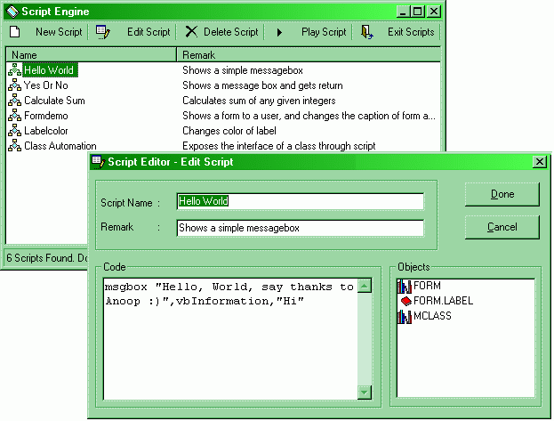



## Script Engine: Allow end users to extend your app using VB

### Description

Hi Folks: Hurray, I made that!!. Dont shiver with excitation, but now you can interpret VBScript to extend the interfaces of your application. Allow your end users to extend your program using the power of Visual Basic. Hm.., I can't find any reason for these US Software companies not to provide me an H1 visa to join them :). You can interpret VB from your own application. Getting a little confused? Imagine this. Your end users can write VB code to extend your application interfaces. Simply like Microsoft uses VBA to extend Microsoft Office, you can now use VBScript to extend your apps. This means that you can allow your users to develop custom scripting, and you can make programs that work on macros. Amazing, right? In this engine, I shows you how to add forms and class interfaces to the Script Control. Just run the application before even taking a look at the code. One last word, VOTE FOR ME IF YOU FIND THIS USEFULL:::

Also, r u a US based programmer? I am looking for creating tie-ups with established US companies for implementing Web Phone services and Voice chat apps using the latest broadcasting technology I developed, and is planning to relocate to US shortly. Kindly visit my website http://www.geocities.com/streamingaudio if u have enough time.

I would be gratefull if you can provide me information regarding finding investors/sponsors in US for my ventures.

Regards,

Anoop,anoopj12@yahoo.com, http://www.geocities.com/streamingaudio
 
### More Info
 

             |
---                |---
**Submitted On**   |2000-05-30 02:56:42
**By**             |[Anoop Madhusudanan](https://github.com/Planet-Source-Code/PSCIndex/blob/master/ByAuthor/anoop-madhusudanan.md)
**Level**          |Advanced
**User Rating**    |4.6 (185 globes from 40 users)
**Compatibility**  |VB 5\.0, VB 6\.0
**Category**       |[Complete Applications](https://github.com/Planet-Source-Code/PSCIndex/blob/master/ByCategory/complete-applications__1-27.md)
**World**          |[Visual Basic](https://github.com/Planet-Source-Code/PSCIndex/blob/master/ByWorld/visual-basic.md)
**Archive File**   |[CODE\_UPLOAD62175292000\.zip](https://github.com/Planet-Source-Code/anoop-madhusudanan-script-engine-allow-end-users-to-extend-your-app-using-vb__1-8451/archive/master.zip)

